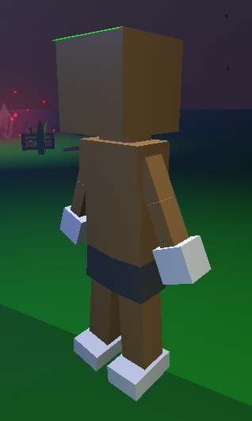

#player

# ScreenShot

# Abilities
## Core
- [ ]  **Run**
 speed increases in current direction
- [ ]  **Jump**
 upwards momentum, limited direction control
 - [ ] **Crouch**
 collision size reduces, slower movement speed
- [ ]  **Pickup**
 uses cursor, grabs items for [[#Player Inventory]]
## Additive
- [ ]  **Slide**
 low stance, forward momentum carries
 - [ ] **Roll**
 tuck and tumble, avoids obstacles
- [ ]  **Double Jump**
 second leap mid-air
 - [ ] **Long Jump**
 powerful forward leap, extra distance
 - [ ] **Wall Jump**
 kick off walls, gain height or redirect
 - [ ] **Glide**
 slow descent, some control
- [ ] **Boost**
 short burst, speed or height
## Upgrades
 - [ ] **Heavy Impact**
 jump or long jump landing, shockwave
 - [ ] **Overcharge**
 boost and run extend, adds cooldown
 - [ ] **Grapple**
 pickup range extends, pulls items

# Player Inventory

- [ ] **Physics based item storage**

When players use the grab [[#Abilities]] the item will drop into a UI box and scale down and tumble as a 2D physics item.

When the inventory is full the item will tumble out of the player and back into the environment

[[Trash]] get deposited in the [[../Stations/Battery-Station]]

# Cosmetics
These are only for the fashion
## Wood
- [ ] Oak: Sturdy, natural grain patterns, maybe a rugged, earthy look.
- [ ] Bamboo: Lightweight, sleek, with a segmented, almost armored aesthetic.
- [ ] Driftwood: Weathered, gnarled, with a coastal or ancient feel.
- [ ] Ebony: Dark, polished, giving a mysterious or elegant twist.

## Metal
- [ ] Iron: Rough, industrial, maybe rusted edges for a battle-worn vibe.
- [ ] Bronze: Warm-toned, slightly aged, with a steampunk or classical edge.
- [ ] Steel: Sleek, shiny, modern—think high-tech golem.
- [ ] Gold: Ornate, regal, maybe etched with runes or filigree.

## Stone
- [ ] Granite: Chunky, solid, with a speckled, immovable look.
- [ ] Marble: Smooth, veined, almost statuesque and refined.
- [ ] Obsidian: Glossy, black, sharp-edged—like volcanic glass.
- [ ] Sandstone: Crumbly, warm-toned, with a desert or ancient ruin feel.

## Elemental
- [ ] Fire: Cracked, glowing seams, maybe charred or molten touches.
- [ ] Ice: Translucent, frosty, with jagged crystalline spikes. 
- [ ] Storm: Swirling patterns, electric sparks, or cloudy textures.
- [ ] Earth: Moss-covered, rocky, with vines or gemstone inlays.

## Crystal
Think shimmering, translucent materials with a mystical or otherworldly vibe.
- [ ] Quartz (clear, prismatic)
- [ ] Amethyst (deep purple, regal)
- [ ] Emerald (vibrant green, natural)
- [ ] Sapphire (cool blue, sleek)

## Bone
A gritty, organic option with a primal or undead edge.
- [ ] Ivory (smooth, pale)
- [ ] Fossil (petrified, ancient)
- [ ] Skull (bleached, menacing)
- [ ] Chitin (insect-like, segmented)

## Fabric
For a softer, more crafted or artificial look—less natural than wood, more deliberate.
- [ ] Silk (flowing, delicate)
- [ ] Leather (tough, weathered)
- [ ] Canvas (rugged, utilitarian)
- [ ] Velvet (plush, luxurious)

## Energy
A dynamic, less tangible category with glowing or ethereal effects.
- [ ] Aether (soft, wispy glow)
- [ ] Plasma (sharp, electric arcs)
- [ ] Void (dark, absorbing light)
- [ ] Solar (bright, radiant flares)

## Clay
Malleable, earthy, with a hand-sculpted or artisanal feel.
- [ ] Terracotta (warm, reddish)
- [ ] Porcelain (smooth, fragile-looking)
- [ ] Mud (rough, wet sheen)
- [ ] Glazed (shiny, colorful finish)

## Glass
Fragile yet striking, with a reflective or transparent quality.
- [ ] Stained (multicolored, mosaic-like)
- [ ] Frosted (opaque, misty)
- [ ] Blown (curved, artisanal)
- [ ] Shattered (jagged, battle-damaged)

## Rust
A weathered, decaying vibe that’s distinct from pristine metals.
- [ ] Corroded (pitted, greenish)
- [ ] Flaking (peeling layers)
- [ ] Oxidized (reddish-brown)
- [ ] Patina (aged, bluish-green)

## Plant
Living or once-living organic material, blending nature with construct.
- [ ] Vine (twisting, green)
- [ ] Bark (rough, protective)
- [ ] Moss (soft, overgrown)
- [ ] Petal (delicate, colorful)

## Steam
A mechanical, industrial feel with a hint of motion or power.
- [ ] Brass (polished, piped)
- [ ] Soot (dark, smoky)
- [ ] Vented (hiss of steam)
- [ ] Gilded (ornate, Victorian)

## Shadow
Dark, elusive, with a mysterious or intangible edge.
- [ ] Mist (swirling, faint)
- [ ] Onyx (solid, glossy black)
- [ ] Fade (blurry edges)
- [ ] Echo (flickering, ghostly).

# Voice Chat
- [ ] Mimic
- [ ] Proximity

# Weapons, Skills, Gadgets
- [ ] Chips
- [ ] Hands
- [ ] HandCannon

# UI
## FillME